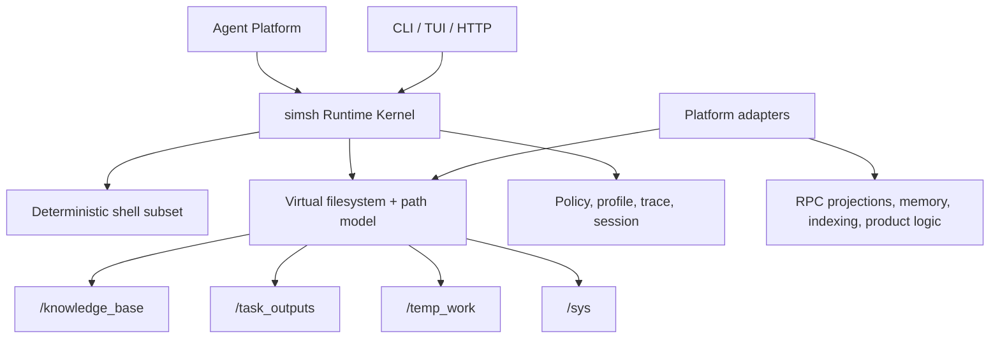

# simsh

> Deterministic command runtime for agent systems.

`simsh` is a lightweight sandbox for agent execution. It combines a constrained shell runtime, an AI-friendly virtual filesystem, and embeddable policy/audit hooks into one reusable core.

It is designed for higher-level agent platforms that need a predictable execution surface. It is not trying to be a full POSIX shell, a container runtime, or a product-specific workflow engine.

## Status

`simsh` is experimental, but the current baseline already includes:

- local CLI and interactive TUI execution
- an HTTP `/v1/execute` runtime service
- policy/profile-gated builtin commands
- AI-friendly virtual filesystem zones
- path metadata via `ls -l` and opt-in API metadata
- a documented extension boundary for adapter-driven mounts
- structured execution result contracts
- execution tracing with side-effect tracking
- adapter lifecycle and memory protocol hooks
- first-class session lifecycle management

Project boundaries and non-goals live in [`docs/notes-project-charter.md`](docs/notes-project-charter.md).

## When to use simsh

Use `simsh` when you need:

- a smaller and more inspectable execution model than a general-purpose shell
- explicit filesystem zones for source material, scratch work, and durable outputs
- policy/profile enforcement that can be surfaced to agents, adapters, and APIs
- a reusable runtime core that stays separate from product-specific orchestration

Choose something else if you need:

- broad POSIX compatibility
- container- or VM-style isolation guarantees
- a workflow engine with built-in domain semantics

## Why simsh

General-purpose shells are powerful, but they are noisy execution environments for agents:

- too much ambient state
- weak path intent signaling
- unclear write boundaries
- hard-to-consume results for planning loops

`simsh` narrows the runtime on purpose:

- **deterministic shell subset** for predictable execution
- **purpose-oriented virtual paths** so agents can infer intent from names
- **explicit policy and profile controls** instead of implicit host behavior
- **filesystem metadata and mount semantics** that make capabilities visible
- **generic core + adapter boundary** so business logic stays out of the runtime kernel

## Architecture At A Glance


```mermaid
flowchart TB
  platform["Agent Platform"] --> runtime["simsh Runtime Kernel"]
  runtime --> shell["Deterministic shell subset"]
  runtime --> fs["Virtual filesystem + path model"]
  runtime --> controls["Policy, profile, trace, session"]
  fs --> kb["/knowledge_base"]
  fs --> out["/task_outputs"]
  fs --> tmp["/temp_work"]
  fs --> sys["/sys"]
  adapters["Platform adapters"] --> fs
  adapters --> adapter_logic["RPC projections, memory, indexing, product logic"]
  entry["CLI / TUI / HTTP"] --> runtime
```

## Kernel Model

`simsh` should be read first as a runtime kernel, not as a CLI or HTTP product.

The kernel owns:
- shell execution semantics
- filesystem projection boundaries
- policy and profile enforcement
- path metadata and capability signaling
- structured execution result and trace contracts
- session primitives

Core packages:
- `pkg/contract`: stable interfaces and shared types
- `pkg/sh`: shell parsing and execution semantics
- `pkg/fs`: virtual filesystem composition and adapter glue
- `pkg/engine/runtime`: runtime assembly (`sh + fs + policy/profile`)

The target property is not shell completeness. The target property is a lightweight execution kernel that agents can trust.

## Default Agent Workspace

What matters to an agent is not the repository package order. It is the default working environment it sees when execution begins.

### Filesystem zones

The virtual root exposes only a small set of high-signal directories:

| Path | Purpose |
| --- | --- |
| `/knowledge_base` | source-oriented reference material and mirrored external artifacts |
| `/task_outputs` | durable deliverables and final agent-authored artifacts |
| `/temp_work` | temporary intermediates, scratch output, and disposable state |
| `/sys` | virtual runtime metadata and builtin command namespace |

These names are intentionally explicit so an agent can reason about where output belongs before it writes. Writeability is still controlled by the active policy.

### Path model and `cwd`

`simsh` exposes an explicit virtual path model instead of inheriting host-shell ambiguity:
- session-local virtual `cwd`
- relative-path resolution against that virtual `cwd`
- path metadata and capabilities instead of trial-and-error probing
- mount-backed and synthetic paths that remain capability-limited even when reachable through the same tree

### Default builtin surface

The default workspace includes a focused builtin command set for inspection, search, text manipulation, and safe file mutation:
- inspection and workspace awareness: `ls`, `tree`, `pwd`, `env`, `which`, `type`, `man`, `frontmatter`, `json`, `date`
- text and search: `cat`, `head`, `tail`, `grep`, `find`, `diff`, `sort`, `uniq`, `wc`, `sed`
- file mutation: `mkdir`, `cp`, `mv`, `rm`, `rmdir`, `touch`, `tee`

The command surface is intentionally constrained. The goal is a high-signal agent workspace, not a full shell clone.

Structured output conventions in the default workspace:
- defaults stay dual-readable and pipe-aware where that interaction model matters
- `--json` is used when a command naturally returns one summary object
- `--fmt jsonl` is used when a command naturally returns a stream of flat records
- `--fmt json` stays available for commands that already expose a broader output family such as `text|json|md`

Examples:
- `wc --json ...` for one structured count summary
- `grep --fmt jsonl ...` for one JSON record per match/context row
- `find --fmt jsonl ...` for one JSON record per discovered path
- `json stat --fmt json ...` for one structured JSON-shape report
- `json get --path items[0].name ...` for one targeted JSON subtree extraction

### Result and trace contract

The default workspace is not just files and commands. It also includes a machine-consumable execution contract:
- structured `ExecutionResult`
- structured `ExecutionTrace`
- path access metadata via `ls -l` and opt-in API metadata

That is part of the default ACI, because it shapes how an agent verifies what happened after each step.

## Adapter Boundary

Adapters matter more than entry surfaces because they define how the kernel reaches the real world.

`simsh` keeps domain logic out of core packages. Memory systems, resource projections, skill-like trees, and RPC-backed views are expected to live behind adapter-driven `VirtualMount` integrations rather than being hard-coded into the kernel.

That means:
- generic core
- opinionated adapters
- explicit projection boundaries

See:
- [`docs/architecture-platform-adapter-contract.md`](docs/architecture-platform-adapter-contract.md)
- [`docs/architecture-memory-skills-extension.md`](docs/architecture-memory-skills-extension.md)

## Entry Surfaces

CLI, TUI, and HTTP are important integration surfaces, but they are not the product soul of `simsh`.

Entry surfaces:
- `pkg/cmd`: CLI/TUI-facing runtime helpers
- `pkg/service/httpapi`: HTTP execute endpoint
- `cmd/simsh-cli`: local runtime (`CLI + TUI + serve`)
- `cmd/simshd`: dedicated HTTP service
- `cmd/simsh-doc`: generator for `simsh.md`

They should stay thin wrappers over the same runtime kernel rather than becoming a second architecture center.

## Quick Start

### Requirements

- Go `1.22+`

### Build and test

```bash
go test ./...
go build ./cmd/simsh-cli
go build ./cmd/simshd
```

### Run locally

```bash
# one-shot command
go run ./cmd/simsh-cli -profile core-strict -c 'ls -l "/"'

# interactive TUI
go run ./cmd/simsh-cli

# line-based REPL
go run ./cmd/simsh-cli --no-tui

# HTTP runtime service
go run ./cmd/simsh-cli serve -P 18080 -root "$PWD" -profile core-strict

# dedicated HTTP binary
go run ./cmd/simshd -listen ':18080' -root "$PWD" -profile core-strict
```

You can also use the included `Makefile`:

```bash
make test
make check
make cli
make cli-c CMD='ls -l /'
make cli-serve PORT=18080
make simshd
```

## Examples

### Inspect the virtual root

```bash
go run ./cmd/simsh-cli -profile core-strict -c 'ls -l "/"'
```

Example output:

```text
d ro knowledge_dir - /knowledge_base
d ro virtual_dir - /sys
d ro task_output_dir - /task_outputs
d ro temp_work_dir - /temp_work
# columns: mode access kind lines path
```

### Call the HTTP API with metadata

```bash
curl -sS http://127.0.0.1:18080/v1/execute \
  -H 'Content-Type: application/json' \
  -d '{
    "command": "ls -l /knowledge_base",
    "profile": "core-strict",
    "policy": "read-only",
    "include_meta": true
  }'
```

Example response:

```json
{
  "output": "# columns: mode access kind lines path",
  "exit_code": 0,
  "meta": {
    "paths": [
      {
        "mode": "d",
        "access": "ro",
        "kind": "knowledge_dir",
        "lines": -1,
        "path": "/knowledge_base",
        "capabilities": ["describe", "list", "search"]
      }
    ]
  }
}
```

## What simsh is not

`simsh` intentionally does not try to solve everything inside the runtime kernel.

Non-goals include:

- full POSIX shell compatibility
- container or VM-style isolation
- hard-coded product workflows
- domain-specific memory or orchestration semantics in core packages
- treating one reference workload as the source of truth for all abstractions

## Documentation

Start here:

- [`simsh.md`](simsh.md): generated runtime profile
- [`docs/notes-project-charter.md`](docs/notes-project-charter.md): project goals, scope, and non-goals
- [`docs/architecture.md`](docs/architecture.md): current architecture overview
- [`docs/notes-requirements.md`](docs/notes-requirements.md): current cross-cutting product/ACI requirements
- [`docs/notes-builtin-aci-review.md`](docs/notes-builtin-aci-review.md): builtin ACI review and per-tool optimization directions
- [`docs/architecture-path-access-metadata.md`](docs/architecture-path-access-metadata.md): path metadata and listing/API formats
- [`docs/architecture-memory-skills-extension.md`](docs/architecture-memory-skills-extension.md): extension boundary for mounts and business-layer systems

Next-stage design docs:

- [`docs/architecture-session-trace-model.md`](docs/architecture-session-trace-model.md): planned session and execution trace contracts
- [`docs/architecture-platform-adapter-contract.md`](docs/architecture-platform-adapter-contract.md): platform adapter, memory lifecycle, and projection seams
- [`docs/notes-v0-1-0-to-v0-2-migration.md`](docs/notes-v0-1-0-to-v0-2-migration.md): migration plan from the `v0.1.0` baseline to the planned `v0.2` contract set

Historical context:

- [`docs/first_version_plan.md`](docs/first_version_plan.md): v1 implementation history and completed scope

## Development

Common commands:

```bash
make test
make test-race
make lint
make check
make doc
```

`make doc` regenerates [`simsh.md`](simsh.md) from the current runtime description.

## Contributing

The runtime is still experimental, so boundary discipline matters more than feature count.

Before changing core behavior:

- read [`docs/notes-project-charter.md`](docs/notes-project-charter.md) and the relevant architecture docs
- keep core contracts generic; push workload semantics into adapters unless a contract has proven reusable
- run `make check` and `go test ./...`

If a change updates SOP/frontmatter-driven docs under `docs/`, regenerate [`docs/must-sop.md`](docs/must-sop.md).

## Roadmap

The current baseline focuses on deterministic execution, virtual filesystem semantics, and policy/profile controls.

Planned next-stage work is documented and split into implementation feats around:

- first-class session lifecycle
- structured execution results
- execution traces with side-effect tracking
- adapter lifecycle and optional memory protocol hooks
- adapter-backed end-to-end validation

Those contracts are described in the architecture docs above and tracked in the feat harness under `.bagakit/ft-harness/`.
