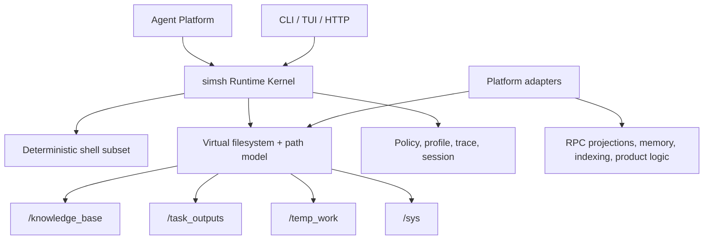

# simsh

> Agentic sandbox kernel for harnesses, memory-aware runtimes, and AgentOS-style systems.

`simsh` is a lightweight sandbox kernel for agent execution. It gives an agent a constrained shell, a purpose-oriented virtual filesystem, explicit policy boundaries, and structured execution feedback without forcing you to boot a VM or hand an unconstrained host shell to the model, and it is meant to sit under a harness, a memory-aware runtime, or an AgentOS-style stack rather than replace those layers. In that stack, it should be read as one of the most important infrastructure layers: the execution substrate that higher-level planning, memory, review, and workflow systems can safely build on.

`simsh` is kernel-first. CLI, TUI, and HTTP are useful entry surfaces, but they are downstream wrappers over the same runtime model rather than the product center; the center is the execution contract: path truth, policy truth, session truth, and trace truth.

## Why simsh

General-purpose shells are powerful, but they are a poor default execution environment for many agent loops. They carry too much ambient state, make path intent and mutation boundaries hard to read, and force planners or reviewers to recover machine meaning from stdout-heavy behavior; that is tolerable for a human operator, but wasteful for an agent loop that has to inspect, search, edit, verify, and hand results back to a harness.

`simsh` narrows that surface on purpose. It keeps determinism ahead of shell completeness, keeps filesystem zones explicit, makes policy and profile choices visible, and treats structured result and trace contracts as first-class runtime truth instead of post-hoc audit glue, which makes it a better substrate for harnesses that need predictable execution, memory-aware runtimes that need explicit projection seams, and AgentOS-style stacks that want a reusable kernel under planning, review, and UI layers. The practical claim is stronger than “nice to have”: if the execution substrate is unstable, the rest of the harness stack tends to inherit that instability.

It is not a fit when you need broad POSIX compatibility, VM-grade isolation, or a workflow engine with built-in product semantics.

## Release Status

The latest tagged release line in this repository is now `v0.3.0`. Current `main` should be read as the post-`v0.3.0` patch candidate line for `v0.3.1`, not as another `v0.3.0` closeout branch and not as a new feature wave. The migration guide for the released line remains [`docs/notes-v0-2-x-to-v0-3-0-migration.md`](docs/notes-v0-2-x-to-v0-3-0-migration.md).

The released `v0.3.0` line already includes the kernel-first positioning, stronger mount contract language, richer benchmark evidence, and paired uplift proof story. Current `main` is narrower: it carries post-`v0.3.0` hardening and release-facing truth cleanup, especially around remote high-latency mount proof and release/evidence alignment. The project is still experimental in product positioning, but that is an expectation-setting statement rather than a claim that the current tree lacks tests, benchmarks, or runtime discipline.

Historical `v0.3.0` closeout lives in [`docs/notes-v0-3-0-release-readiness.md`](docs/notes-v0-3-0-release-readiness.md). The current patch-line closeout lives in [`docs/notes-v0-3-1-patch-release-readiness.md`](docs/notes-v0-3-1-patch-release-readiness.md).

## Quick Start

### Build And Check

You need Go `1.22+`. The default release gate is small and explicit:

```bash
make check
go test -race ./...
```

If you only want the core binaries:

```bash
go build ./cmd/simsh-cli
go build ./cmd/simshd
go build ./cmd/simsh-doc
```

### Run The Sandbox

One-shot execution:

```bash
go run ./cmd/simsh-cli -profile core-strict -c 'ls -l "/"'
```

Interactive local runner:

```bash
go run ./cmd/simsh-cli
```

The TUI is a human operator console: history, scrollback, status chips, and cancel. Agents should use `-c` or the HTTP execute API, not this console. `?` shows keys; `ctrl+c` cancels a running command; `ctrl+d` quits.

Example virtual-root output:

```text
d ro knowledge_dir - /knowledge_base
d ro virtual_dir - /sys
d ro task_output_dir - /task_outputs
d ro temp_work_dir - /temp_work
# columns: mode access kind lines path
```

### Optional Service Surface

If you need an integration service rather than a local sandbox session, expose the HTTP layer explicitly. It is a supported wrapper over the same kernel, but it is not the primary story of the project.
The default listen scope is loopback-only because the HTTP session-control surface exposes live execution identity and command information and is intended for local or otherwise trusted callers unless a higher layer adds its own auth boundary.

Start the service:

```bash
go run ./cmd/simsh-cli serve -P 18080 -root "$PWD" -profile core-strict
```

Call `/v1/execute` with path metadata enabled:

```bash
curl -sS http://127.0.0.1:18080/v1/execute \
  -H 'Content-Type: application/json' \
  -d '{
    "command": "ls -l /knowledge_base",
    "profile": "core-strict",
    "policy": "read-only",
    "include_meta": true
  }'
```

Create a session, start a session-bound execution, inspect its live state, and cancel that exact execution by `execution_id`:

```bash
BASE_URL="http://127.0.0.1:18080"
SESSIONS_ROUTE="v1/sessions"
EXECUTE_ROUTE="v1/execute"
CANCEL_ACTION="cancel"

SESSION_JSON="$(curl -sS "$BASE_URL/$SESSIONS_ROUTE" -H 'Content-Type: application/json' -d '{}')"
SESSION_ID="$(printf '%s' "$SESSION_JSON" | jq -r '.session.session_id')"

curl -sS "$BASE_URL/$EXECUTE_ROUTE" \
  -H 'Content-Type: application/json' \
  -d "{\"session_id\":\"$SESSION_ID\",\"command\":\"sleep 30\"}" >/tmp/simsh-exec.json &
EXEC_PID=$!

ACTIVE_EXECUTION_ID=""
while [ -z "$ACTIVE_EXECUTION_ID" ] || [ "$ACTIVE_EXECUTION_ID" = "null" ]; do
  ACTIVE_EXECUTION_ID="$(curl -sS "$BASE_URL/$SESSIONS_ROUTE/$SESSION_ID" | jq -r '.session.active_execution.execution_id')"
  [ "$ACTIVE_EXECUTION_ID" = "null" ] && sleep 0.1
done
curl -sS "$BASE_URL/$SESSIONS_ROUTE/$SESSION_ID/$CANCEL_ACTION" \
  -H 'Content-Type: application/json' \
  -d "{\"expected_execution_id\":\"$ACTIVE_EXECUTION_ID\"}"

wait "$EXEC_PID"
```

## Kernel And Sandbox Model


```mermaid
flowchart TB
  platform["Agent Platform"] --> runtime["simsh Runtime Kernel"]
  runtime --> shell["Deterministic shell subset"]
  runtime --> fs["Virtual filesystem + path model"]
  runtime --> controls["Policy, profile, trace, session"]
  fs --> kb["/knowledge_base"]
  fs --> out["/task_outputs"]
  fs --> tmp["/temp_work"]
  fs --> sys["/sys"]
  adapters["Platform adapters"] --> fs
  adapters --> adapter_logic["RPC projections, memory, indexing, product logic"]
  entry["CLI / TUI / HTTP"] --> runtime
```

### Kernel Contracts

The kernel owns shell execution semantics, virtual filesystem projection boundaries, policy and profile enforcement, path metadata, structured execution results, execution traces, and session primitives. The main core packages are `pkg/contract`, `pkg/sh`, `pkg/fs`, and `pkg/engine/runtime`, and that boundary matters because `simsh` is supposed to be a reusable execution kernel: product workflows, memory curation logic, retrieval systems, and orchestration policy belong above it, not inside it. In practical terms, `simsh` should make a harness or AgentOS layer reliable enough to build on, not compete with it for ownership.

### Default Workspace

The agent sees a small, semantic virtual root instead of an ambient host filesystem:

| Path | Purpose |
| --- | --- |
| `/knowledge_base` | source-oriented reference material and mirrored external artifacts |
| `/task_outputs` | durable deliverables and final agent-authored artifacts |
| `/temp_work` | temporary intermediates, scratch output, and disposable state |
| `/sys` | runtime metadata and builtin command namespace |

The workspace also carries an explicit virtual path model. `cwd` is session-local, relative paths are resolved inside that virtual tree, and mount-backed or synthetic paths keep their capability limits instead of pretending to be ordinary local directories.

The default builtin surface is intentionally narrow. It focuses on inspection, search, structure-aware querying, text manipulation, and safe file mutation rather than shell completeness. The concrete runtime profile is generated into [`simsh.md`](simsh.md), and the ACI rationale lives in [`docs/notes-builtin-aci-review.md`](docs/notes-builtin-aci-review.md).

### Adapter And Mount Boundary

Adapters are the seam where external systems, memory views, skills, and other projected trees enter the runtime. `simsh` expects those seams to stay explicit: projection truth, lifecycle hooks, trace consumption, freshness, capability contracts, and mount latency or consistency guarantees all need to be documented rather than inferred, which is where the project leans toward memory-aware runtimes and AgentOS-style systems most directly.

This matters most once mounts stop being cheap local views. If a mount sits on top of DB, OS, RPC, search, or mixed persistence layers, the runtime should dispatch by capability and latency contract instead of silently degrading into `ls | cat | grep | rg | find` fanout loops; the kernel should preserve good agent behavior even when the filesystem is partly synthetic and partly remote.

In particular, `remote_high_latency` mounts are not treated as transparent local directories. When a critical capability is missing, `simsh` should explicitly refuse the workload or require a narrower scope rather than quietly fanning out into repeated list, read, search, or mutation calls.

### Entry Surfaces

CLI, TUI, and HTTP are intentionally thin wrappers over the same runtime stack. They exist because a sandbox kernel still needs local and service entrypoints, but they stay secondary to the execution contract itself. In practice that means:

| Surface | Role |
| --- | --- |
| `cmd/simsh-cli` | local CLI, TUI, and `serve` entrypoint |
| `cmd/simshd` | dedicated HTTP service |
| `pkg/service/httpapi` | `v1/execute` plus session create/get/control integration surface |
| `pkg/cmd` | CLI/TUI-facing helpers |

If a semantic change only exists in one entry surface, it is usually in the wrong layer.

## Evidence And Metrics

The repository keeps three benchmark layers because they answer different questions, and the current evidence is strong enough that it should be surfaced rather than hidden in subdirectories.

The checked-in native reference suite currently passes all configured gates: `trace_completeness=1.0`, `session_success=1.0`, `reviewable_patch_latency_ms=25`, and `async_completion_success=1.0`. The checked-in paired uplift proof is also directionally strong: on the current three-task manifest, full `simsh` succeeds `3/3` while the thinner baseline succeeds `2/3`, with `0` retries vs `3`, `0` misunderstandings vs `3`, and `149` observation tokens vs `3826`. Those numbers are not a cross-project leaderboard claim, but they are repo-local proof that the kernel is reducing wasted model work and making the sandbox easier for a large model to use correctly.

[`benchmarks/simsh_native_reference/README.md`](benchmarks/simsh_native_reference/README.md) is the native proof layer. It answers whether the kernel supports realistic agent file workflows well enough to justify the abstraction, not only the unit tests.

[`benchmarks/terminal_bench_compare/README.md`](benchmarks/terminal_bench_compare/README.md) is the external comparison layer. It stays downstream from the native suite and asks what the smallest checked-in Terminal-Bench comparison artifact worth maintaining is right now.

[`benchmarks/paired_uplift/README.md`](benchmarks/paired_uplift/README.md) is the A/B proof layer. It holds the task set, agent, and budgets fixed while comparing full `simsh` against one thinner repo-controlled baseline substrate, so it can measure not just runtime behavior but also large-model execution efficiency.

Useful entrypoints:

```bash
go run ./benchmarks/simsh_native_reference
make benchmark-refresh
make benchmark-uplift
```

## Documentation

### Start Here

- [`simsh.md`](simsh.md): generated runtime profile
- [`docs/notes-project-charter.md`](docs/notes-project-charter.md): goals, scope, and non-goals
- [`docs/architecture-overview.md`](docs/architecture-overview.md): architecture narrative in kernel-first order
- [`docs/notes-requirements.md`](docs/notes-requirements.md): current cross-cutting requirements
- [`docs/notes-builtin-aci-review.md`](docs/notes-builtin-aci-review.md): builtin UX and output-contract rationale
- [`docs/notes-v0-3-0-release-readiness.md`](docs/notes-v0-3-0-release-readiness.md): current release-closeout checklist and evidence snapshot

### Integration And Runtime Contracts

- [`docs/architecture-session-trace-model.md`](docs/architecture-session-trace-model.md): current session/result/trace contract layer
- [`docs/architecture-platform-adapter-contract.md`](docs/architecture-platform-adapter-contract.md): adapter lifecycle and projection seam
- [`docs/architecture-memory-skills-extension.md`](docs/architecture-memory-skills-extension.md): extension boundary for memory and skills
- [`docs/architecture-path-access-metadata.md`](docs/architecture-path-access-metadata.md): path metadata and listing/API formats
- [`docs/architecture-high-performance-mount-system.md`](docs/architecture-high-performance-mount-system.md): high-performance mount design and capability dispatch
- [`docs/notes-v0-1-0-to-v0-2-migration.md`](docs/notes-v0-1-0-to-v0-2-migration.md): migration guide from `v0.1.0` to the released `v0.2` contract line
- [`docs/notes-v0-2-x-to-v0-3-0-migration.md`](docs/notes-v0-2-x-to-v0-3-0-migration.md): migration guide from the `v0.2.x` release line to the released `v0.3.0` line
- [`docs/notes-v0-3-0-release-readiness.md`](docs/notes-v0-3-0-release-readiness.md): historical closeout checklist for the `v0.3.0` line
- [`docs/notes-v0-3-1-patch-release-readiness.md`](docs/notes-v0-3-1-patch-release-readiness.md): current patch-line closeout note for `v0.3.1`

### Historical Context

- [`docs/notes-first-version-plan.md`](docs/notes-first-version-plan.md): first implementation wave and completed historical hardening scope

## Development

The current engineering bar is simple: keep core contracts generic, keep adapter and mount seams explicit, and do not trade away low-noise runtime truth for short-term convenience. The README is not the place to document every seam in full, but it should make the project center obvious: `simsh` is an agent sandbox kernel first, and example entry surfaces only matter insofar as they expose that kernel cleanly.

Common commands:

```bash
make test
make test-race
make lint
make check
make doc
```

If you change docs with SOP/frontmatter implications, regenerate [`docs/must-sop.md`](docs/must-sop.md). If you change mounts, tool behavior, or any flow that can amplify remote-backed filesystem pressure, re-read [`docs/architecture-high-performance-mount-system.md`](docs/architecture-high-performance-mount-system.md) first.

The current pre-`v0.3.x` work queue lives in [`docs/notes-kernel-execution-backlog.md`](docs/notes-kernel-execution-backlog.md). That document is the SSOT for what the kernel should do next and how each item is supposed to be validated.
