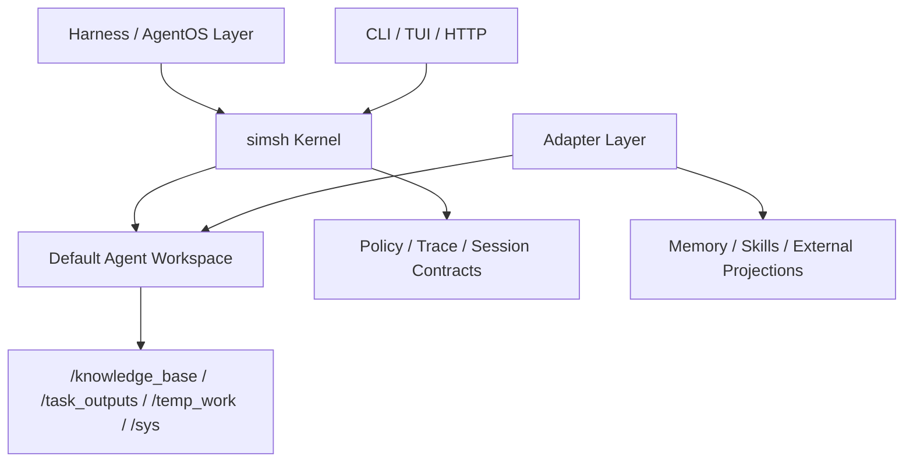

# simsh Architecture

`simsh` should be explained in agent-facing dependency order, not in package-directory order.

The right narrative is:
1. what the kernel is;
2. what default workspace the agent sees;
3. where that workspace can extend into the real world;
4. how external callers enter the runtime.

That order is more faithful to the project than starting with CLI or HTTP entrypoints.

This also aligns with where `simsh` sits conceptually:
- as a runtime kernel inside a harness
- as an agentic sandbox rather than a container replacement
- as an execution substrate inside an AgentOS-style stack
- as a reusable core beneath memory, planning, and UI layers

## Kernel

The kernel is the product core.

It owns:
- shell execution semantics
- virtual filesystem projection boundaries
- policy and profile enforcement
- path metadata and capability signaling
- execution result and trace contracts
- session lifecycle primitives

Core package model:
- `pkg/contract`: stable interfaces and shared types
- `pkg/sh`: shell runtime (`parser + planner + executor + builtin dispatch`)
- `pkg/fs`: filesystem runtime (virtual zones + metadata + safety boundaries)
- `pkg/engine/runtime`: runtime composition (`sh + fs + policy/profile`)

The kernel is the place where trust, determinism, and default agent leverage should be judged first.
It is also the piece a harness or AgentOS layer should depend on, rather than reimplement.

## Default Agent Workspace

For an agent, architecture is experienced first as a working environment.

### Filesystem zones

The default workspace exposes explicit filesystem zones:
- `/knowledge_base`: source-oriented reference material
- `/task_outputs`: durable derived outputs
- `/temp_work`: scratch and disposable intermediates
- `/sys`: runtime metadata and builtin command namespace

These names are intentionally semantic so an agent can reason about write intent before mutation begins.

### Path model and `cwd`

The workspace uses a virtual path model rather than inheriting host shell behavior:
- session-local virtual `cwd`
- explicit relative-path resolution
- mount-backed and synthetic paths with stable capability limits
- path metadata via `access` and `capabilities`

### Builtin command surface

The default ACI includes a focused builtin command set for:
- inspection and workspace awareness
- search and text slicing
- structure-aware JSON inspection
- safe file mutation
- command introspection and manuals

The builtin surface is part of the default workspace contract, not just a tool list.

Structured output conventions are part of that contract:
- defaults should remain dual-readable
- `--json` is for object-style summaries
- `--fmt jsonl` is for record streams
- `--fmt json` remains appropriate where a command already has a broader renderer family
- the first dedicated structure-aware JSON tool is the builtin `json stat/get` surface

### Result and trace contract

The default workspace also includes machine-visible execution semantics:
- structured `ExecutionResult`
- structured `ExecutionTrace`
- path metadata surfaced through command output and API metadata

This matters because agents do not only need files and commands; they also need low-noise feedback about what actually happened.

In other words, the default workspace is the kernel's default ACI, not just its builtin list.

## Adapter Boundary

Adapters define how the kernel reaches the real world and how harness-level systems project memory, skills, and external state into the sandbox.

They are more important than CLI/HTTP entry surfaces, but still conceptually later than the kernel and the default workspace.

Adapter responsibilities include:
- projecting external systems into stable virtual paths
- participating in session lifecycle when persistent state exists
- consuming trace/result fields that matter for platform behavior
- validating the seam with at least one adapter-backed workload

This is the layer where memory and AgentOS-style integration should live.

Recommended references:
- `docs/architecture-platform-adapter-contract.md`
- `docs/architecture-memory-skills-extension.md`

## Entry Surfaces

Entry surfaces are how external callers reach the runtime. They are not the architecture center.

Entry surfaces:
- `pkg/cmd`: runtime entry helpers for CLI/TUI use
- `pkg/service/httpapi`: HTTP execute endpoint
- `cmd/simsh-cli`: local runner (`CLI + TUI + serve`)
- `cmd/simshd`: dedicated HTTP service

Design rule:
- keep entry surfaces thin over the unified runtime stack
- do not invent product semantics or trust-boundary rules in entry adapters first

CLI/TUI are operator surfaces. HTTP is the integration surface for harnesses and higher-level systems. Both should stay downstream from kernel and adapter contracts.

## Design Rules

When architecture tradeoffs are discussed, prefer this order:
1. kernel correctness and trust
2. default agent workspace / default ACI quality
3. adapter contract quality
4. entry-surface ergonomics

This keeps the project aligned with its charter as a lightweight agent runtime kernel rather than drifting into a CLI-first or HTTP-first product narrative.

Supporting but non-anchor layers:
- `cmd/simsh-doc`: generated runtime profile tooling

## Current Status

- [x] Core package split (`contract` / `sh` / `fs` / `engine/runtime`)
- [x] Unified runtime composition shared by CLI and HTTP entry surfaces
- [x] Default workspace zones and path metadata
- [x] Structured execution result and trace contracts
- [x] First-class session lifecycle primitives
- [x] Adapter-extension boundary documented
- [x] CLI/TUI and HTTP surfaces available as thin runtime entry layers
